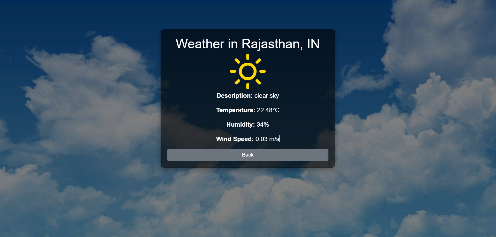

Here's a GitHub caption along with an attractive README outline for your weather app using Java Spring Boot, HTML/CSS, and the OpenWeatherMap API.

---

### GitHub Caption
**🌦️ Simple Weather App - Java Spring Boot | HTML/CSS | OpenWeatherMap API**  
A minimalistic weather app built with Java Spring Boot and a clean HTML/CSS front end, using OpenWeatherMap API to provide real-time weather updates. This project is perfect for those looking to explore Spring Boot, REST APIs, and front-end design.

---

### README Outline

```markdown
# 🌦️ Simple Weather App

A sleek and simple weather app created with **Java Spring Boot**, **HTML/CSS**, and the **OpenWeatherMap API**. Get real-time weather updates with a clean, responsive user interface.

## Features
- 🌐 **Current Weather**: Displays temperature, humidity, and weather conditions.
- 🌎 **City Search**: Look up weather information for any city.
- 📱 **Responsive Design**: Works smoothly on both desktop and mobile devices.

## Technologies Used
- **Java Spring Boot**: Backend server to handle API calls and data processing.
- **OpenWeatherMap API**: Fetches real-time weather data.
- **HTML/CSS**: User-friendly front end with clean design and smooth responsiveness.

## Installation & Setup
1. **Clone the repository**:
   ```bash
   git clone https://github.com/yourusername/weather-app.git
   ```
2. **Get an API Key**: Sign up at [OpenWeatherMap](https://openweathermap.org/) and generate your API key.
3. **Set up the application**:
   - Create a `application.properties` file in `src/main/resources` with the following line:
     ```properties
     weather.api.key=YOUR_API_KEY
     ```
4. **Run the application**:
   ```bash
   mvn spring-boot:run
   ```
5. **Access the app**:
   Open your browser and go to `http://localhost:8080`

## Screenshots

### 🌐 Home Page


### 🌎 City Weather Search



## License
This project is licensed under the MIT License.

## Contributing
Contributions are welcome! Feel free to open issues or submit pull requests.

## Acknowledgements
- [OpenWeatherMap API](https://openweathermap.org/)
- [Spring Boot Documentation](https://spring.io/projects/spring-boot)
